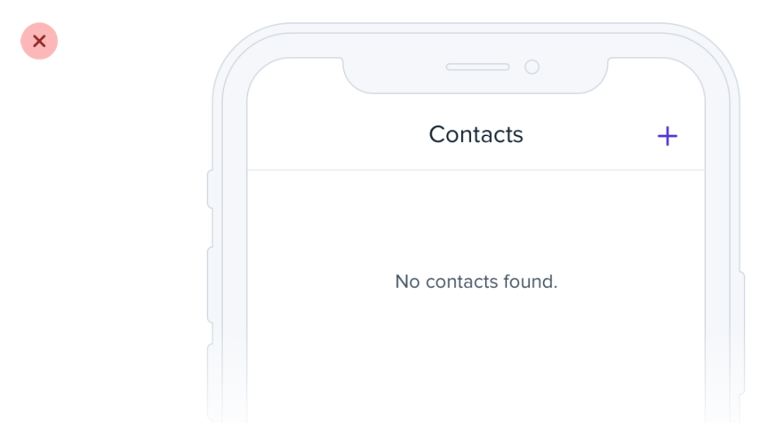
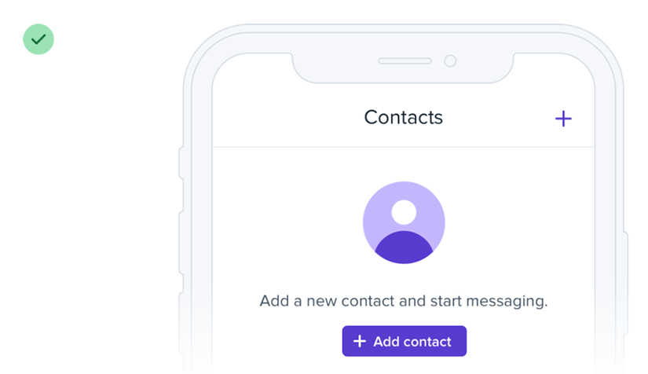
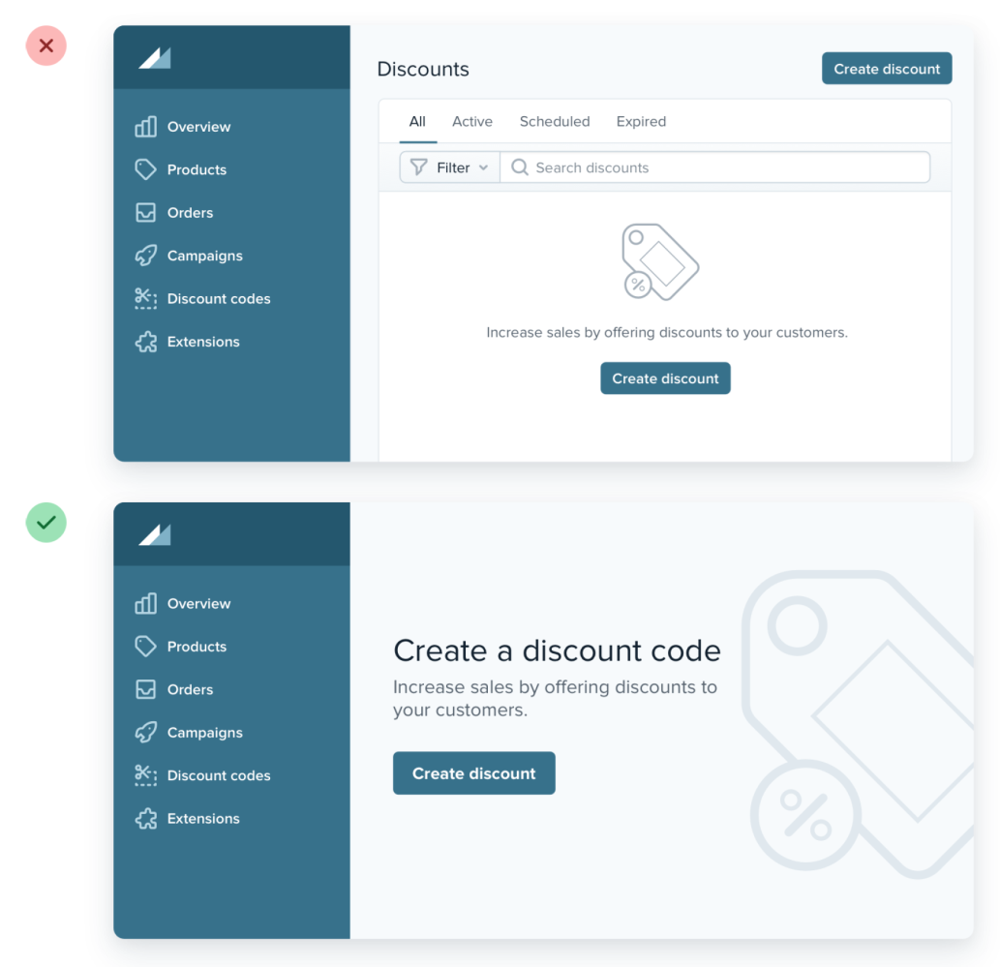

# Beware empty states

## Display add button

If you’re designing something that depends on user-generated content, the empty state should be a priority, not an afterthought.

 

## Hide tabs and filters

If you’re working on something that has a bunch of supporting UI like tabs or filters, consider hiding that stuff entirely. There’s no point in presenting a bunch of actions that don’t do anything until the user has created some content.

