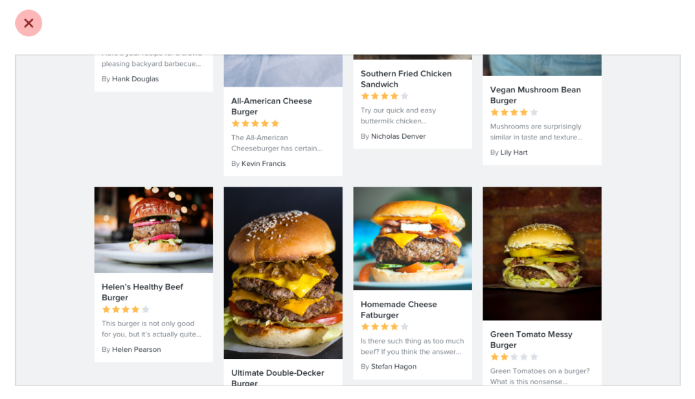
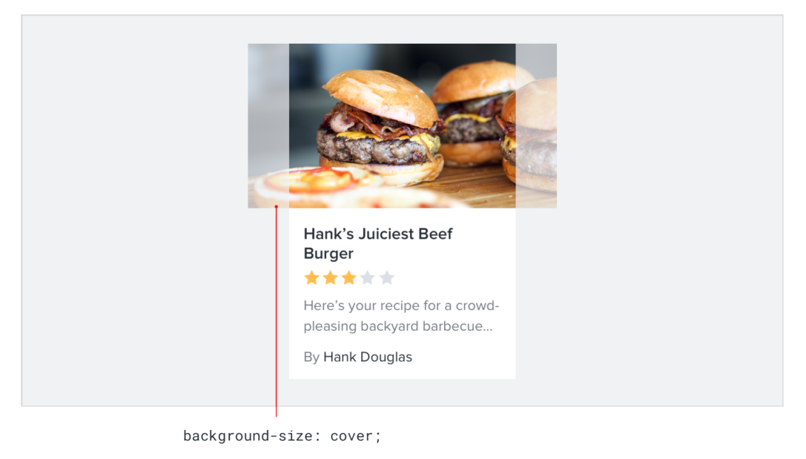
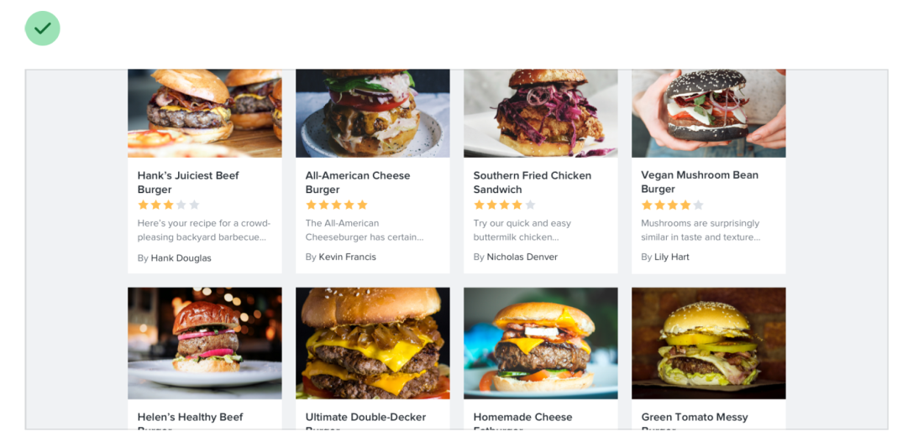
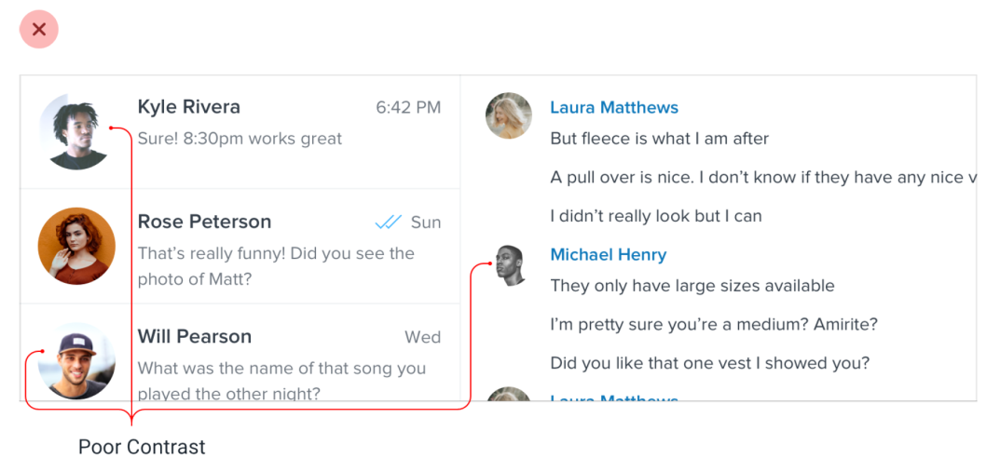
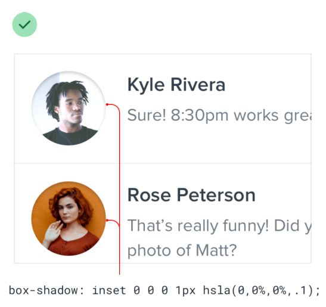
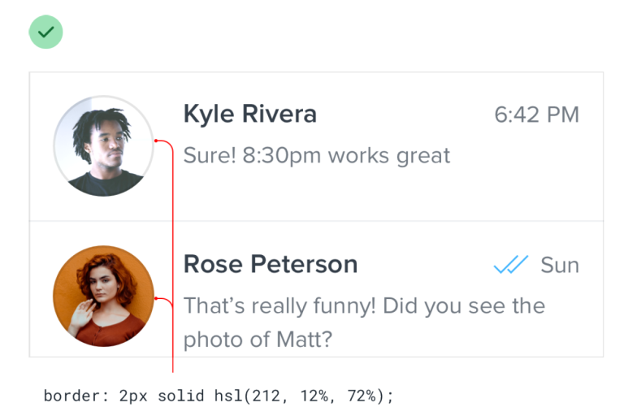

# Beware user content

## Control the shape and size

Center user images inside fixed containers, cropping out anything that doesn’t fit.

## Prevent background bleed

Try using a subtle inner box shadow or semi-transparent inner border.

 

