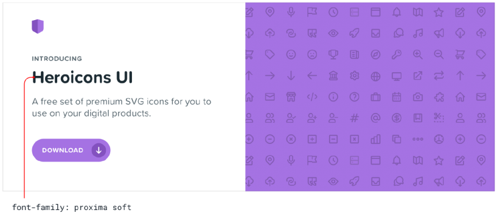
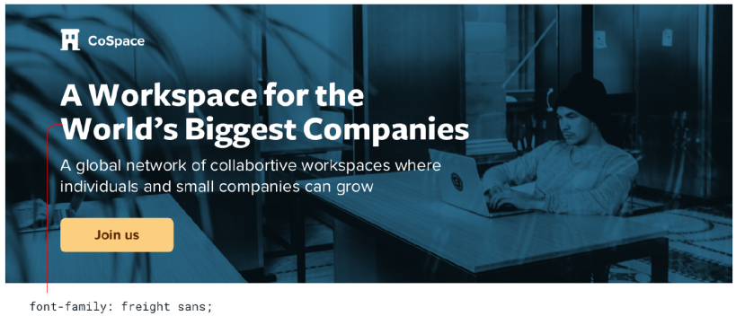
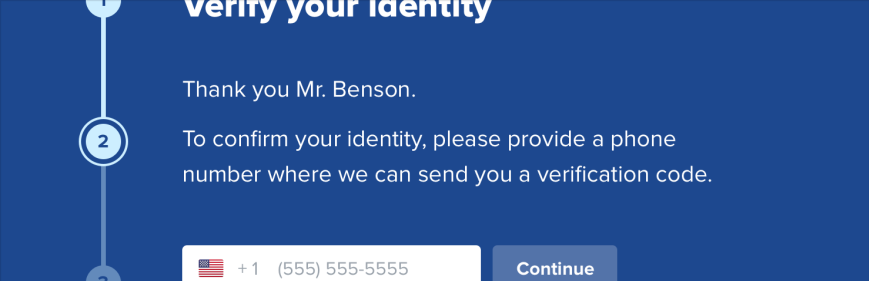
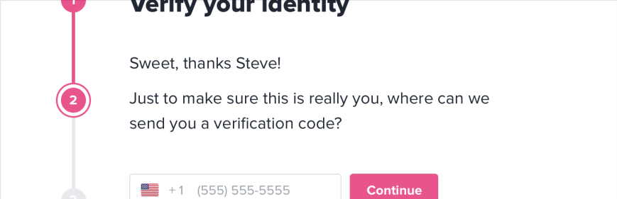

# Choose a personality

## Font and border radius

### **Elegant**&#x20;

FreighText; no border radius

### **Playful**&#x20;

ProximaSoft; large border radius

### **Neutral**

FreightSans; medium border radius

## Color

### **Blue is safe**

### **Gold is sofisticated**

### **Pink is fun**

## Language

### **Official**

### **Frendlier**

