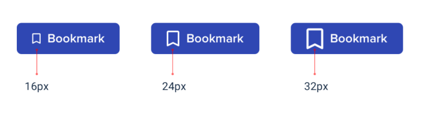
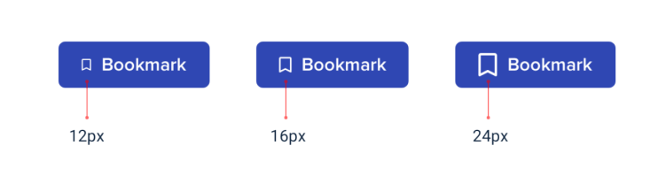

# Design by elimination

To pick the best option, start by taking a guess at which one will look best, maybe 16px.

Then try the values on either side (12px and 24px) for comparison to make sure there’s not a better choice.

