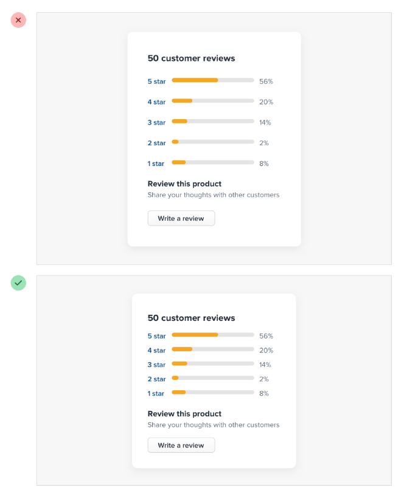

# Start with too much space

Start by giving something way too much space, then remove it until it you’re happy with the result.

Interfaces with a lot of breathing room almost always feel cleaner.

There are certainly situations where it makes sense for a design to be much more compact.

