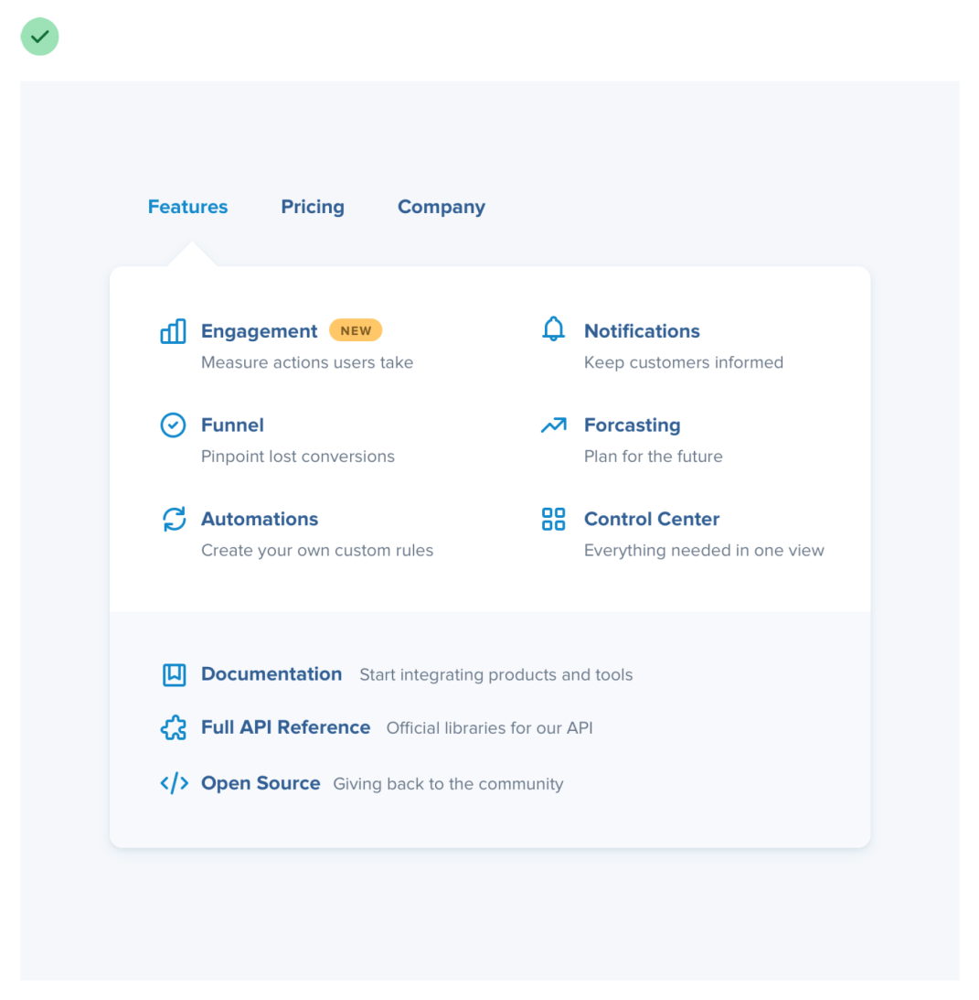
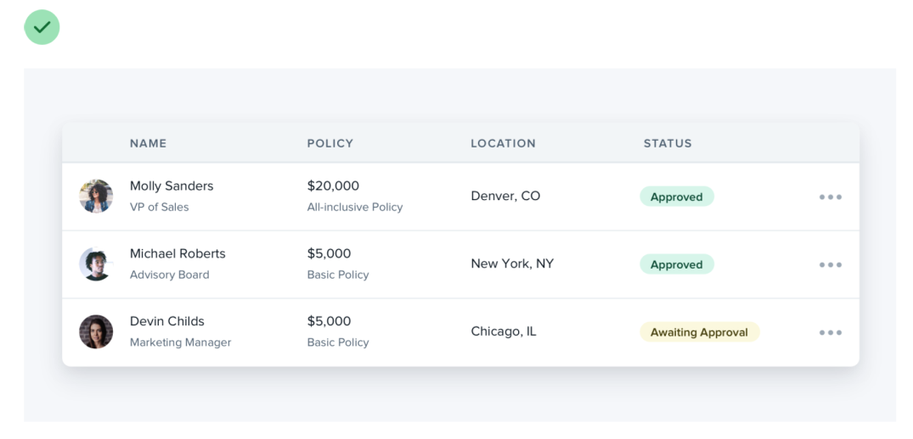
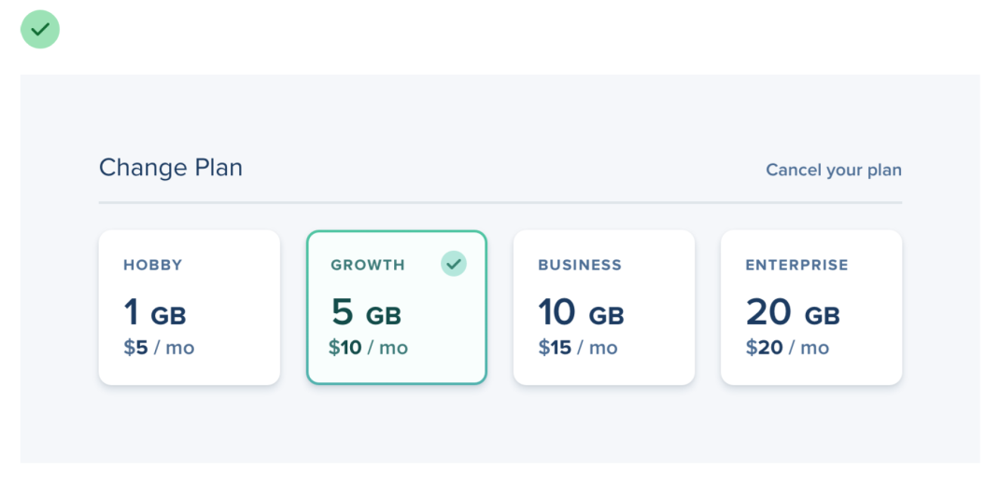

# Think outside the box

## Dropdown

Break dropdown into sections, use multiple columns, add supporting text or colorful icons — do something fun with it!

## Table

If a table column doesn’t need to be sortable, there’s no reason you can’t combine it with a related column and introduce some interesting hierarchy.

## Form

If a set of radio buttons are an important part of the UI you’re designing, try something like selectable cards instead.

