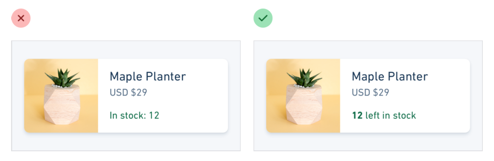
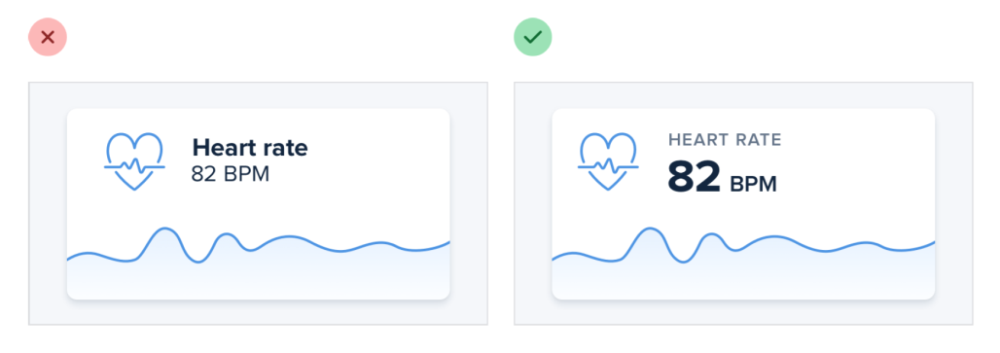
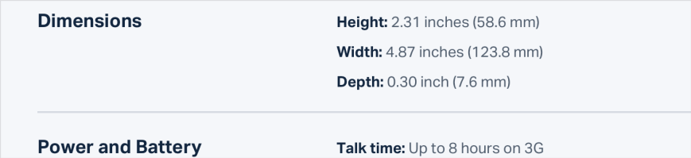

# Avoid labels when possible

## Self-evident data

In a lot of situations, you can tell what a piece of data is just by looking at the format.

## Combine labels and values

Even when a piece of data isn’t completely clear without a label, you can often avoid adding a label by adding clarifying text to the value.

## De-emphasize labels

De-emphasize the label by making it smaller, reducing the contrast, using a lighter font weight, or some combination of all three.

## Exceptions

Labeling is good on information-dense pages, like the technical specifications of a product. If a user is trying to find out the dimensions of a smartphone, they’re probably scanning the page for words like “depth”, not “7.6mm”.

