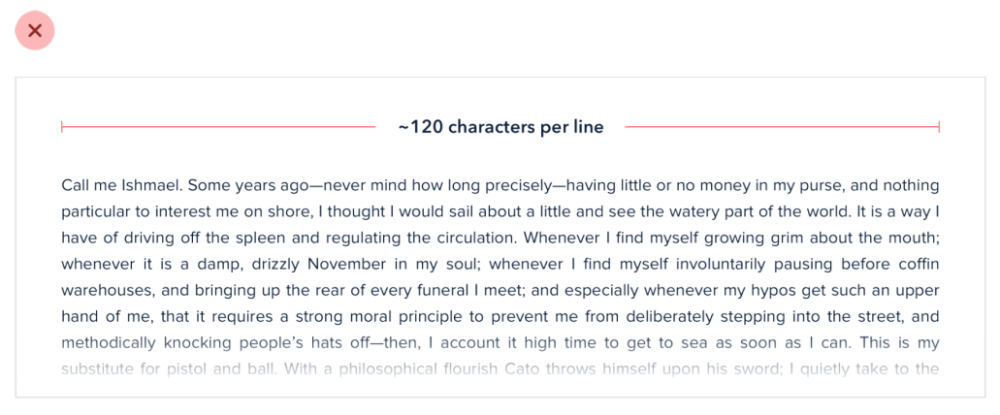
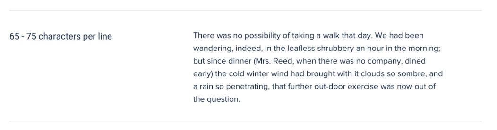

# Avoid too long lines

For the best reading experience, make your paragraphs wide enough to fit between 45 and 75 characters per line.

If you’re mixing paragraph text with images or other large components, you should still limit the paragraph width.

