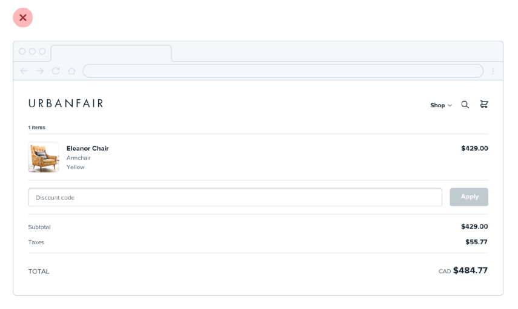
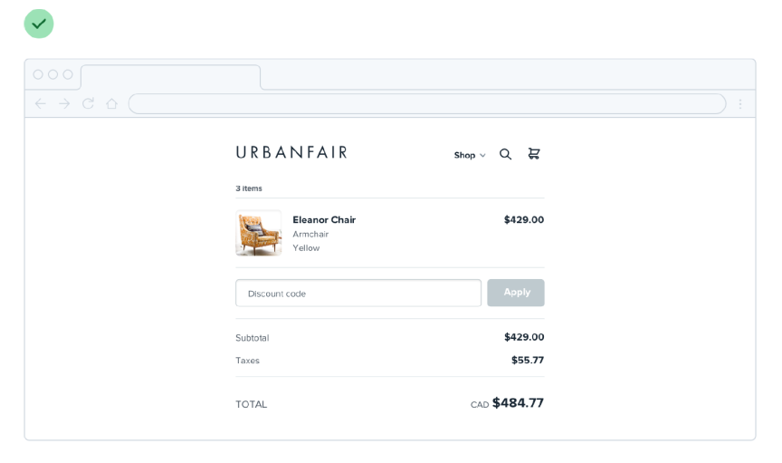
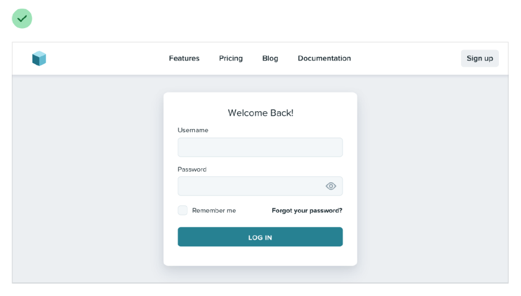

# Don't fill the whole screen

Spreading things out or making things unnecessarily wide just makes an interface harder to interpret, while a little extra space around the edges never hurt anyone.

You don’t need to make everything full-width just because something else (like your navigation) is full-width.

