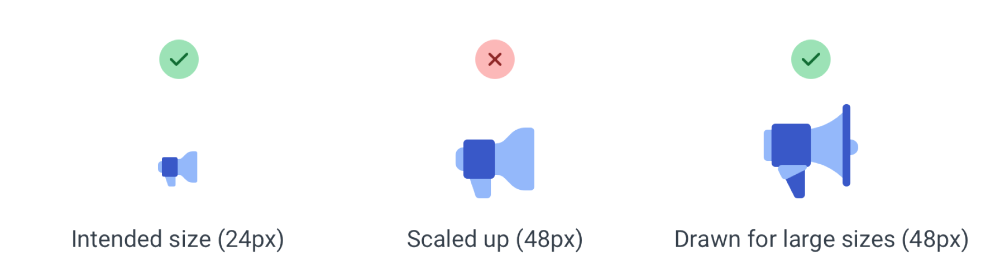
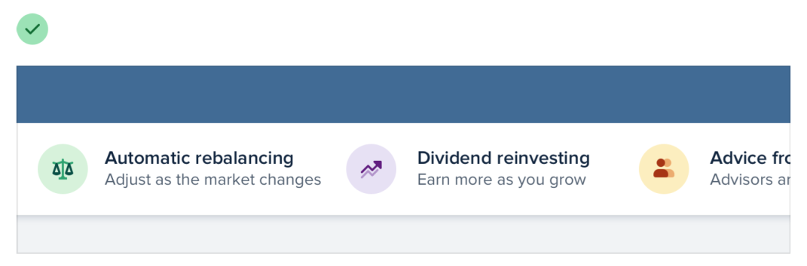
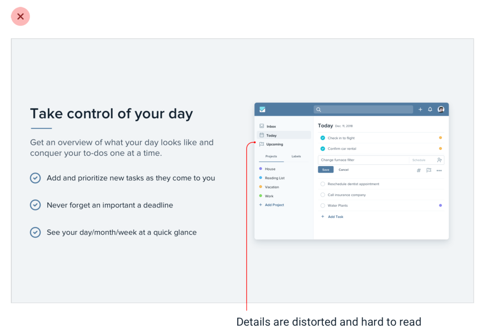
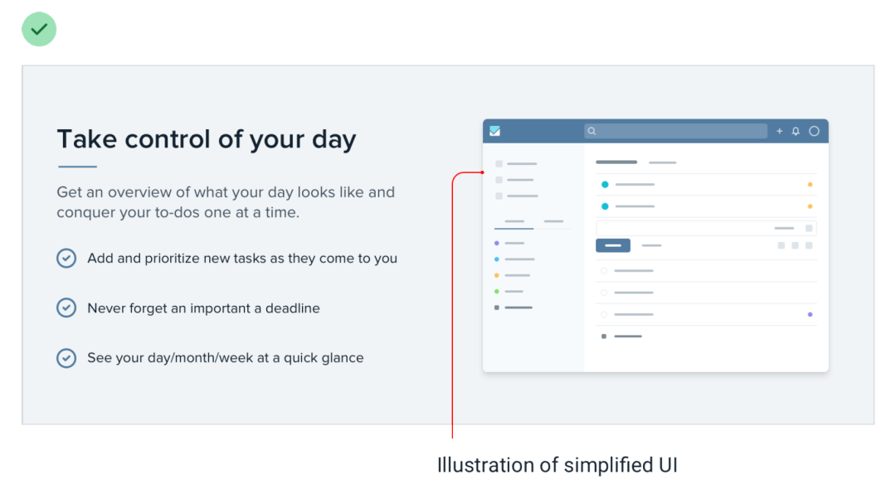
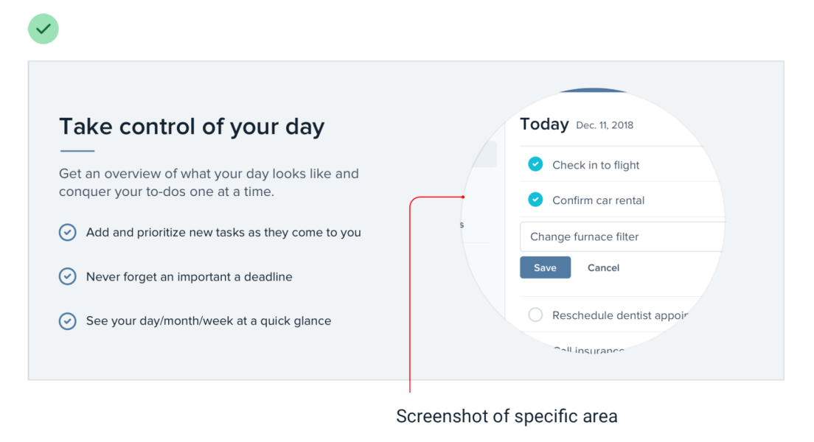
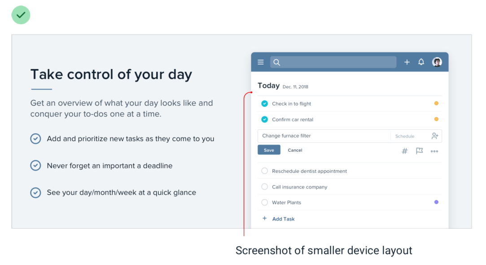

# Don’t scale icons/screenshots

## Don’t scale up icons

Use icons drawn for large size or enclose small icons inside some shape.

## Don’t scale down screenshots

Use specific area, simplified illustration or smaller device layout.

