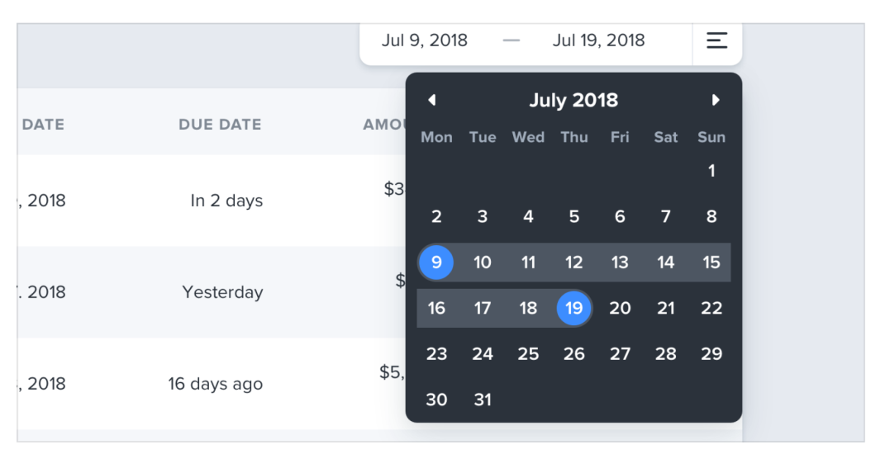
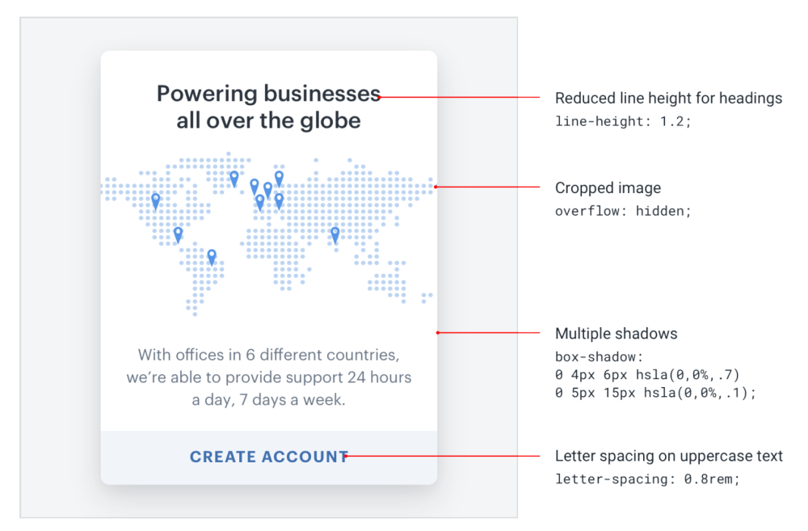

# Look for fresh ideas

## Inverted background color on a datepicker

## Button within a text input

## Different font colors for a headline

## Recreate that design from scratch

The absolute best way to notice the little details that make a design look really polished is to recreate that design from scratch, without peeking at the developer tools.

