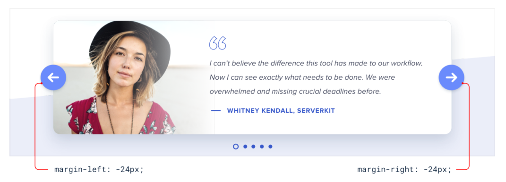
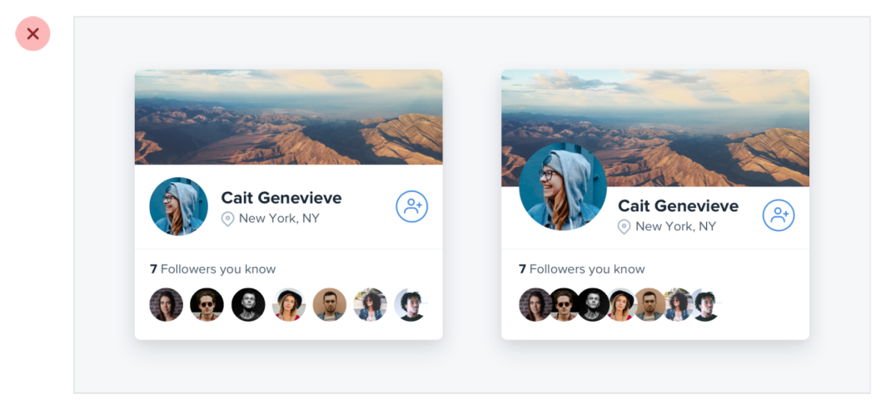
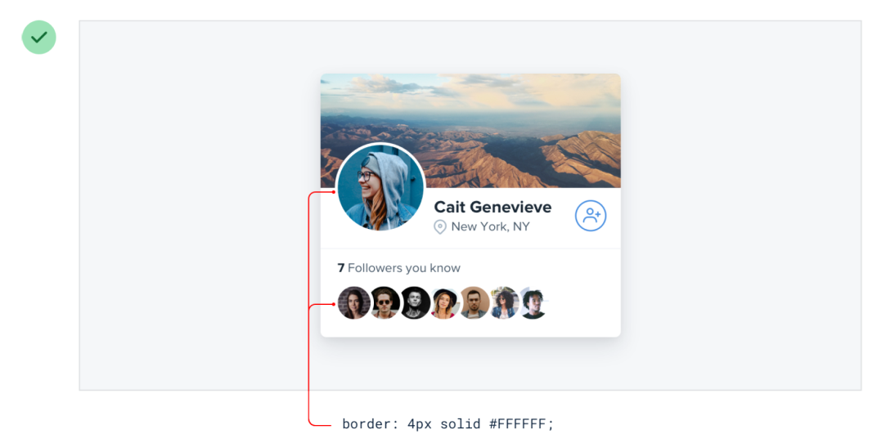

# Overlap elements

## Partially

One of the most effective ways to create depth is to overlap different elements to make it feel like a design has multiple layers.

## Both sides

It could overlap on both sides.

## Components

Overlapping elements can add depth to smaller components too.

## Images

This technique can work great with images as well. Just give the images an “invisible border” to avoid the clash.

