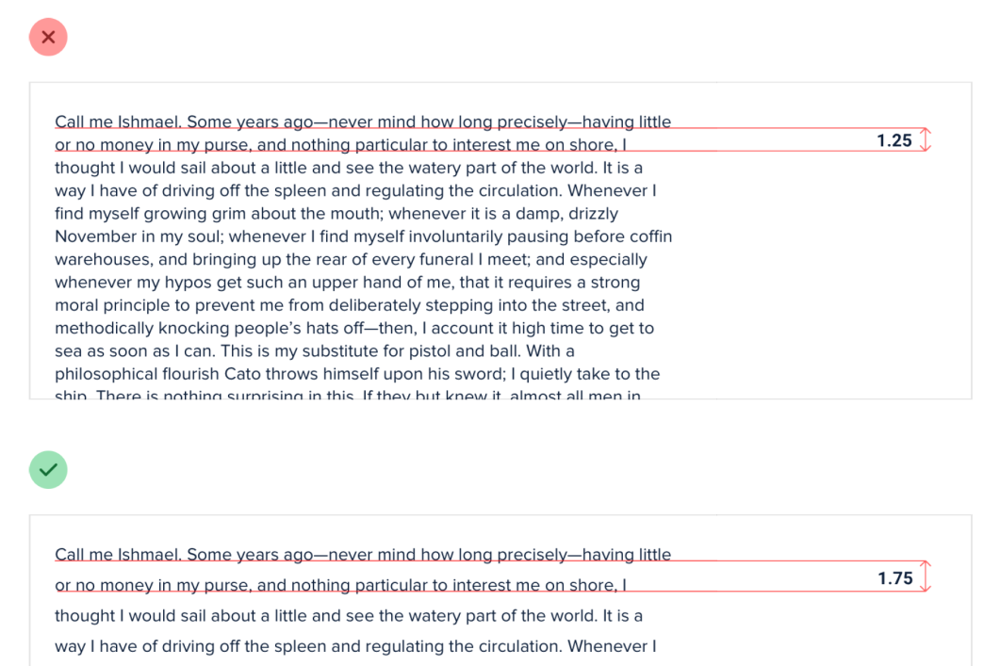
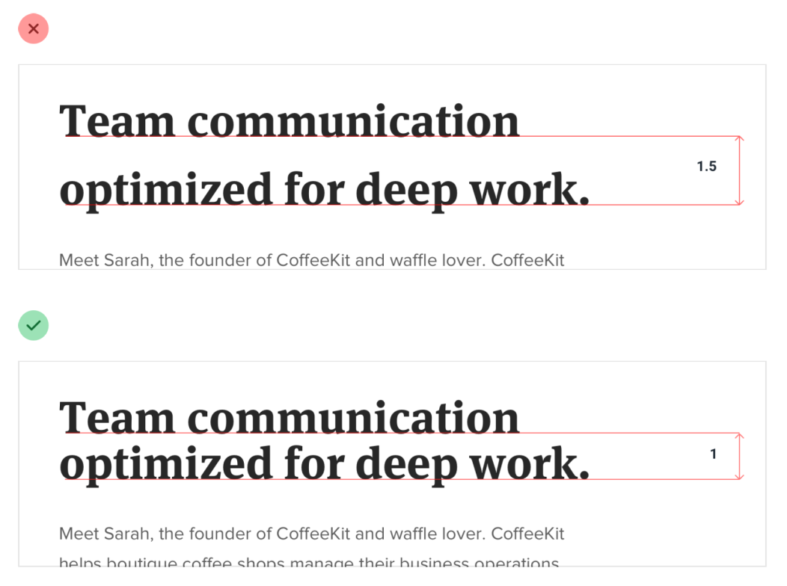
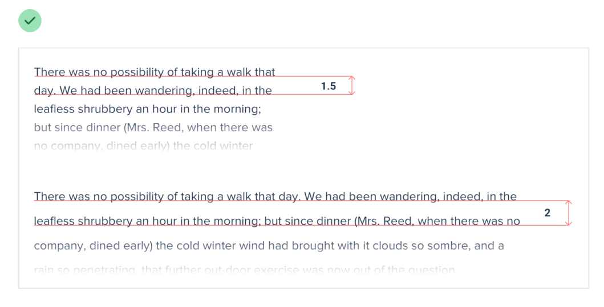

# Contextualize line-height

## Accounting for font size

When text is small, extra line spacing is important because it makes it a lot easier for your eyes to find the next line when the text wraps.

But as text gets larger, your eyes don’t need as much help — lineheight of 1 is perfectly fine.

## Accounting for line length

The further your eyes have to jump horizontally to read the next line, the easier it is to lose your place — narrow content can use a shorter line-height like 1.5, but wide content might need a line-height as tall as 2.

