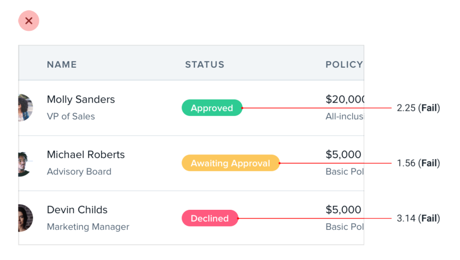
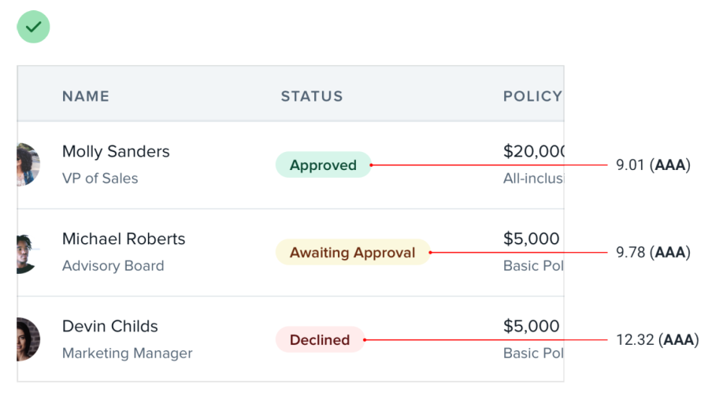
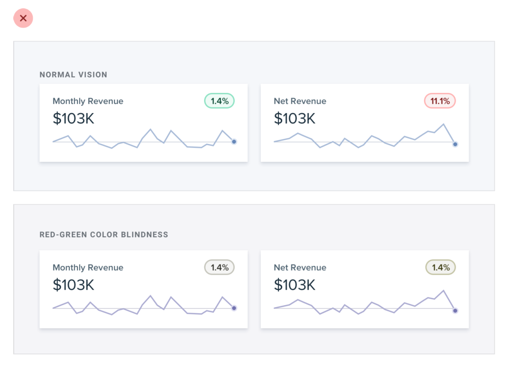
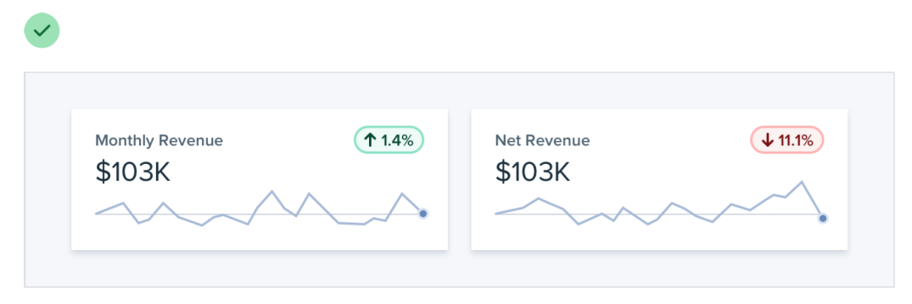
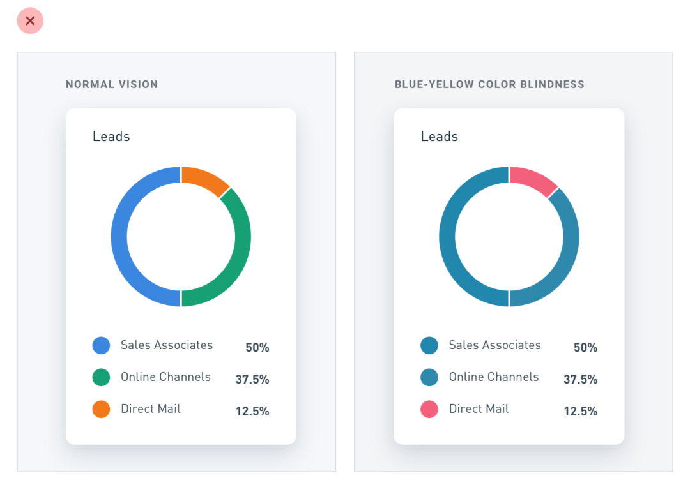

# Make accessible beautiful

## Use dark colored text

Instead of using light text on a dark colored background, use dark colored text on a light colored background.

 

## Use icons

Don’t rely on color alone. Use icons.

## Use contrast

Rely on contrast instead of using completely different colors.

