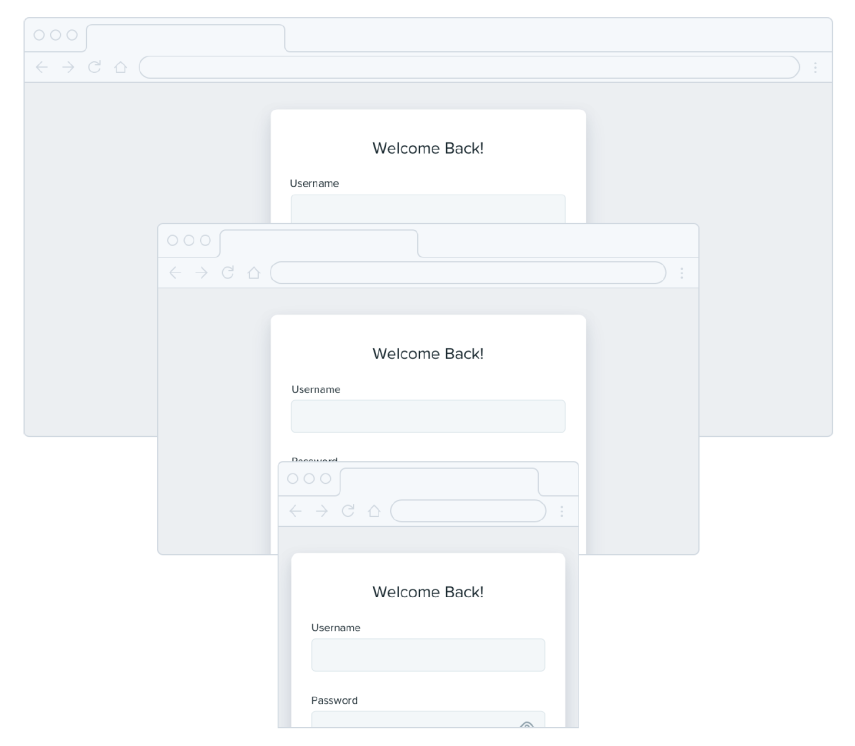
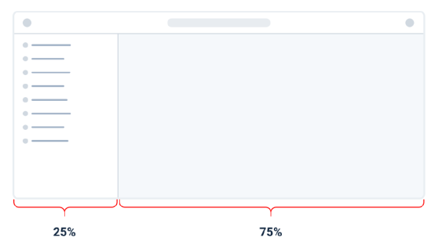
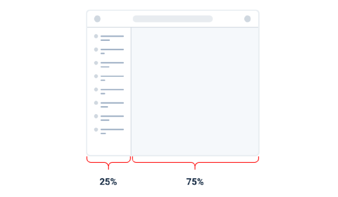

# Use a fixed width

## Sidebar

## Image

## Form

## Problems of fluid

If you make the screen wider the sidebar gets wider too, taking up space that could’ve been put to better use by the main content area. If you make the screen narrower, the sidebar can shrink below its minimum reasonable width, causing awkward text wrapping or truncation.

