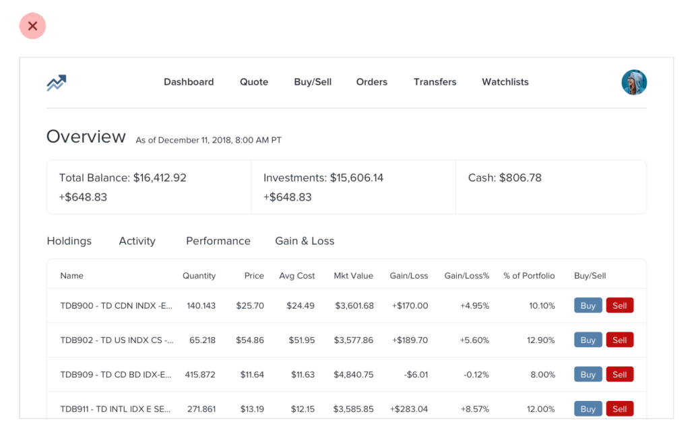
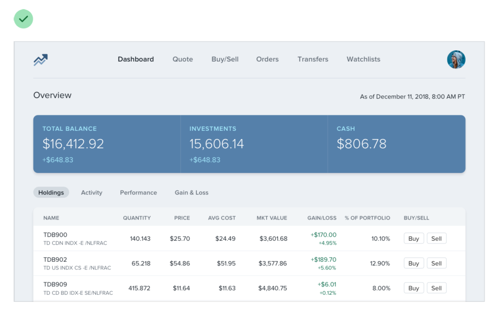
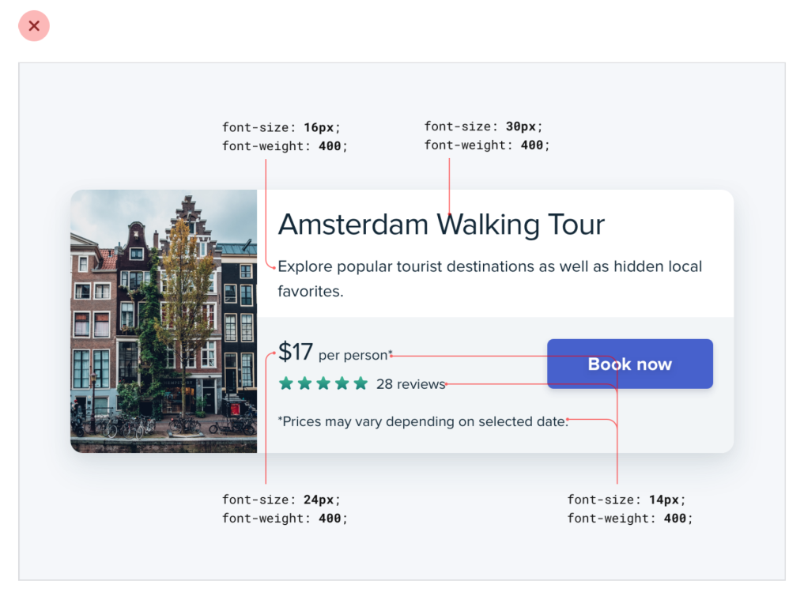
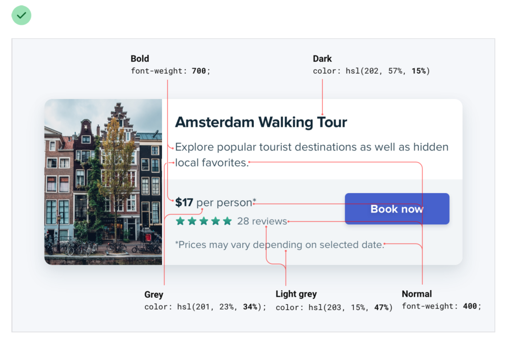
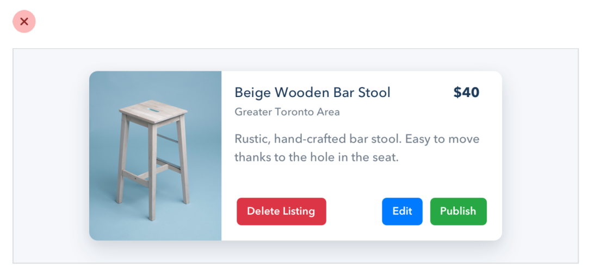
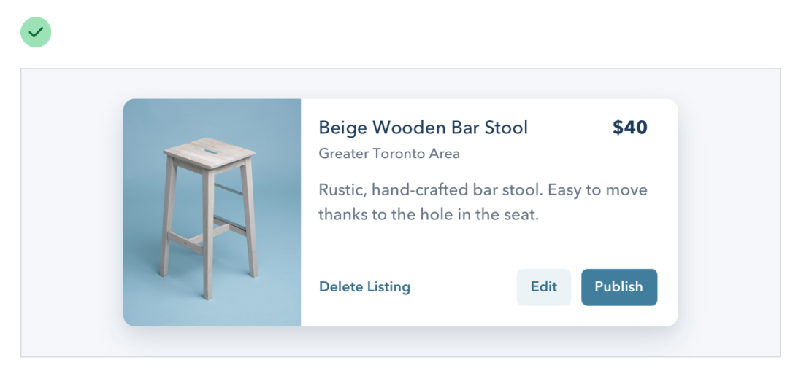
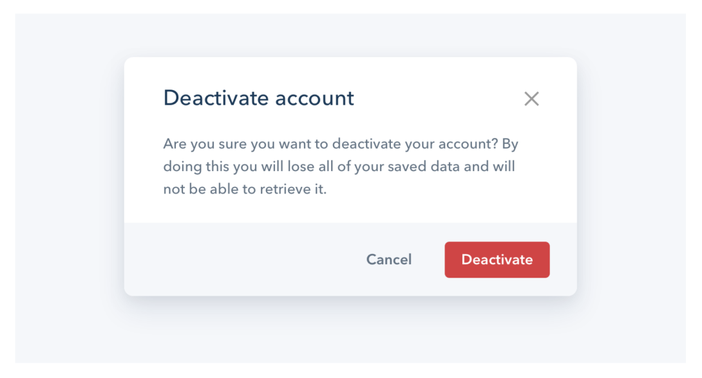
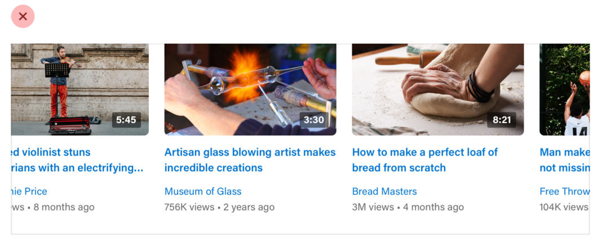

# Use a visual hierarchy

## Highlight the elements that are most important

When everything in an interface is competing for attention, it feels noisy and chaotic, like one big wall of content where it’s not clear what actually matters.

## Build hierarchy with color and weight

Relying too much on font size to control your hierarchy is a mistake — it often leads to primary content that’s too large, and secondary content that’s too small.

## Put buttons in a pyramid of importance

If a destructive action isn’t the primary action on the page, it might be better to give it a secondary or tertiary button treatment.

Combine this with a confirmation step where the destructive action actually is the primary action, and apply the big, red, bold styling there.

## Emphasize links in a subtle way

Not every link needs a color. They’ll still be discoverable, but won’t compete for attention with more important actions on the page.

